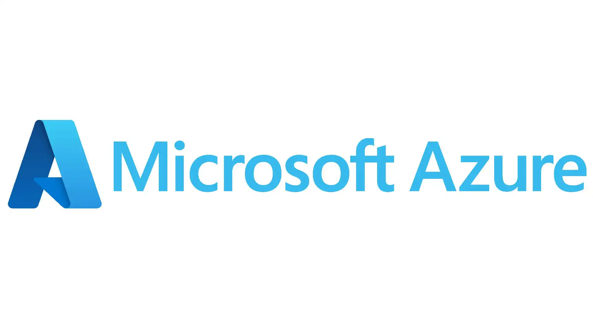

# ☁️ Azure Learning Notes

Welcome to my Azure Learning Notes! This repository serves as a space where I document my journey as I explore Microsoft Azure, the fastest-growing cloud platform. Here, I will be making notes on all the essential aspects of Azure, starting with its core features and services, and expanding into Azure administration and other relevant topics.

## 📑 Contents
- Overview of Azure
- Azure Core Services
  - Compute
  - Storage
  - Networking
- Key Features of Azure
- Azure Administration Notes
- Learning Resources
- Questions or Feedback?

## 💻 Overview of Azure
Microsoft Azure is a comprehensive cloud computing platform that provides a wide array of services for building, deploying, and managing applications and services through Microsoft-managed data centers. With its rapid growth and extensive feature set, Azure is becoming the preferred choice for businesses seeking to leverage cloud technologies.

## 🚀 Why Learn Azure?
- **Market Demand**: Cloud skills, particularly in Azure, are highly sought after in today's job market, making this knowledge invaluable for career development.
- **Versatile Applications**: Azure offers a multitude of tools and services, enabling the creation of scalable and adaptable applications to meet diverse business needs.
- **Hands-On Experience**: This repository will document my practical experiences and learning outcomes as I delve into different Azure services, allowing me to build a comprehensive understanding of cloud administration and management.

## 🛠️ Azure Core Services
In this section, I will focus on documenting essential Azure services related to compute, storage, and networking. I aim to capture detailed insights into the functionality, use cases, and best practices for each service as I learn.

## 🔗 Learning Resources
I will compile links to tutorials, official documentation, and other resources that will assist in my Azure learning journey, providing a solid foundation for understanding cloud concepts.

## 📧 Questions or Feedback?
If you have any questions, suggestions, or feedback, feel free to reach out via email. I'm excited to share my learning journey and hope you find these notes helpful!

